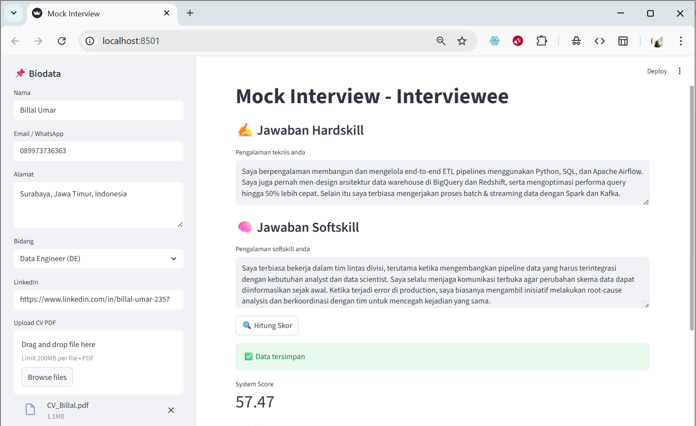
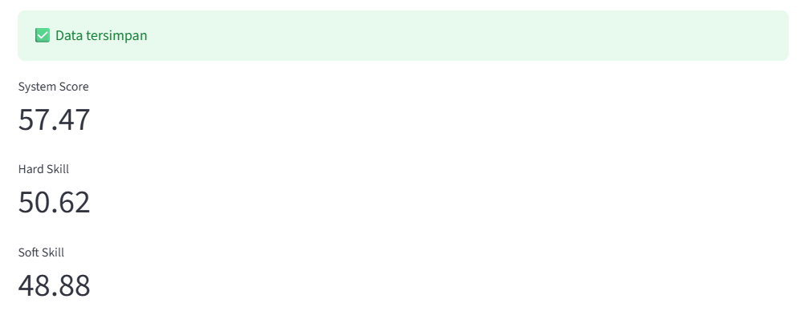
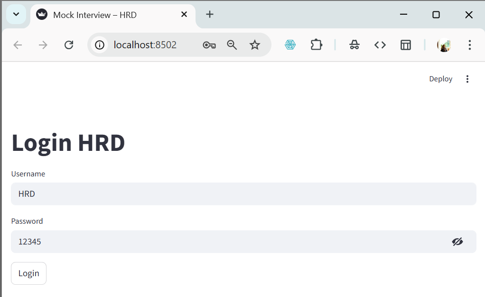
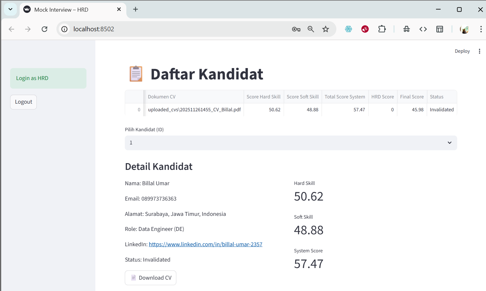
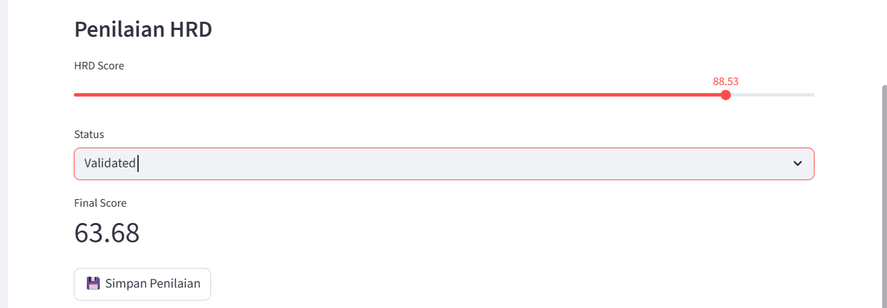
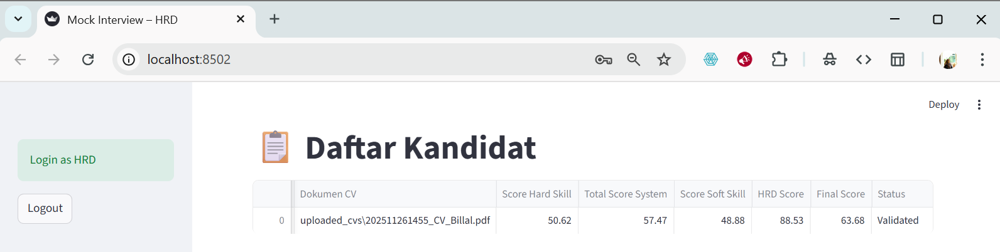

# 📘 Mock Interview Web Apps

### Sistem Penilaian Kandidat Berbasis Text Mining & NLP

---

## 📌 Deskripsi Proyek

**AI Mock Interview Web Apps** adalah aplikasi berbasis web yang dirancang untuk melakukan *assessment* kandidat secara otomatis menggunakan teknik **Text Mining**, **Natural Language Processing (NLP)**, dan **Machine Learning**.

Web Apps ini terdiri dari dua situs utama:

1. **Interviewee App (`app.py`)**
   Kandidat mengisi biodata, menjawab pertanyaan hard skill & soft skill, dan sistem akan menghitung skor otomatis berbasis NLP.

2. **HRD App (`hrd_app.py`)**
   HR dapat melihat daftar kandidat, meninjau hasil scoring otomatis, serta menambahkan nilai manual untuk perhitungan skor final.

---

## 🧠 Fitur Utama

### 🔹 1) Analisis Hard Skill (Multi-Model NLP)

* **Rule-based Expert System**
* **TF-IDF Similarity**
* **BM25 Lexical Evidence**
* **Semantic Similarity (MiniLM Embeddings)**
* **Pattern Extraction (Regex)**

### 🔹 2) Analisis Soft Skill

* **Lexicon-based NLP**
* **Term Frequency (TF)**
* **Tone Weighting menggunakan Sentiment Analysis**

### 🔹 3) Sentiment Analysis

Model yang digunakan:

```
w11wo/indonesian-roberta-base-sentiment-classifier
```

Berbasis:

* HuggingFace Transformers
* PyTorch

### 🔹 4) Semantic Similarity

Model embedding multilingual:

```
paraphrase-multilingual-MiniLM-L12-v2
```

Digunakan untuk mengukur kedekatan jawaban dengan role ideal.

### 🔹 5) Dashboard HRD

* List kandidat
* Detail skor NLP
* Input nilai HR
* Perhitungan final score
* Validasi kandidat

---

## 🧩 Arsitektur Sistem

```
[Interviewee UI] --> [NLP Processing] --> [PostgreSQL DB] --> [HRD Dashboard]
```

Aplikasi berjalan menggunakan:

| Komponen | Teknologi                                  |
| -------- | ------------------------------------------ |
| UI       | Streamlit                                  |
| NLP      | spaCy, Transformers, Sentence-Transformers |
| IR       | TF-IDF, BM25                               |
| ML       | PyTorch                                    |
| DB       | PostgreSQL (Docker)                        |

---

## 📐 Perhitungan Skor

### **System Score**

.png)
.png)
.png)
.png)
.png)
.png)
.png)

### **Final Score (HRD)**

[
Final = 0.8(System) + 0.2(HRD)
]

---

## 🗄️ Database

Menggunakan PostgreSQL (Docker).

### **Command pembuatan DB:**

```bash
docker run -d \
  --name mock_interview_db \
  -e POSTGRES_DB=mock_interview \
  -e POSTGRES_USER=postgres \
  -e POSTGRES_PASSWORD=mock999 \
  -p 5777:5432 \
  postgres:15
```

---

## ⚙️ Instalasi & Menjalankan Aplikasi

### 1. Clone Repository

```bash
git clone https://github.com/intananggreini99/MockInterview_WebApps.git
cd MockInterview_WebApps
```

### 2. Install Dependencies

```bash
pip install -r requirements.txt
python -m spacy download en_core_web_sm
```

### 3. Jalankan Interviewee App

```bash
streamlit run app.py
```

### 4. Jalankan HRD App

```bash
streamlit run hrd_app.py
```

---

## 📁 Struktur Folder

```
MockInterview_WebApps/
│
├── app.py               # Aplikasi untuk kandidat
├── hrd_app.py           # Dashboard HRD
├── uploaded_cvs/        # Folder CV kandidat
├── assets/              # Gambar dokumentasi
├── README.md
└── requirements.txt
```

---

## 🔐 Login HRD

Default user:

| Username | Password |
| -------- | -------- |
| hrd      | 12345    |
| admin    | admin    |

---

## 💻 Tampilan Web Apps

### Interviewee Site




### HRD SIte

* Invalidate Scoring
  
* HRD Scoring
  
* Validate Scoring
  

---

## 📚 Referensi Ilmiah

* Jurafsky & Martin — *Speech and Language Processing*
* Manning et al. — *Introduction to Information Retrieval*
* Reimers & Gurevych — *Sentence-BERT*
* Liu — *Sentiment Analysis and Opinion Mining*
* Robertson — *BM25 Ranking Function*

---

## © Lisensi

License © 2025 — **Intan Dwi Anggreini**
